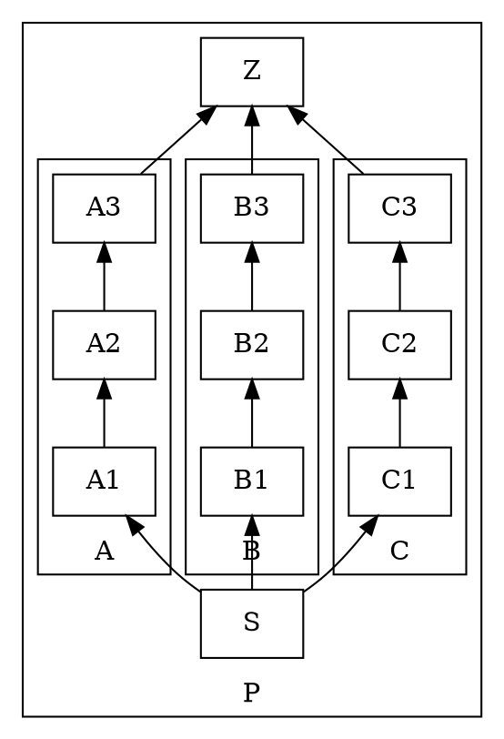
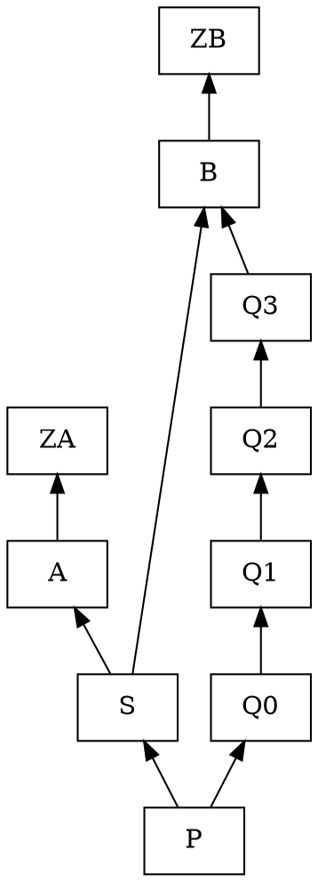
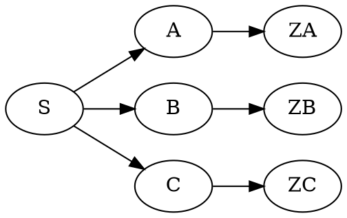

# OpenAI Codex Critique: Graphviz Sibling Ordering Design

I reviewed `/tmp/ordering_design.md`, the renderer paths in
`torchlens/visualization/rendering.py`, `torchlens/data_classes/op.py`, and the supplied
POCs. I ran all empirical checks from `/home/jtaylor/projects/torchlens` with `python`
and `dot`.

Baseline confirmation: `/tmp/poc_fix.py` still reproduces the motivating GoogLeNet
case exactly:

```text
baseline: 9/9 violations; canvas 25.514 x 162.43
rank=same invis chains: 0/9 violations; canvas 22.333 x 160.24
rank=same + newrank=true: 9/9 violations; canvas 24.597 x 164.11
flat invisible constraint=false weighted edges: 9/9 violations; canvas 25.514 x 162.43
```

That proves the primitive can help GoogLeNet. It does not prove the proposed algorithm
is bulletproof.

## Blocking Issues

### 1. Rank Group Scope Is Underspecified and Can Silently Mutilate Nested Clusters

**SEVERITY:** blocking

**Construction:** synthetic DOT with branch nodes owned by child clusters inside a common
parent cluster. The rank group belongs inside the common parent cluster. Appending it at
top level, which is the obvious post-pass insertion after `_setup_subgraphs(...)`, changes
cluster ownership/layout.



Test variants:

```dot
// Correct LCA scope, inside cluster_P:
{ rank=same; A1 -> B1 -> C1 [style=invis]; }

// Wrong top-level post-pass scope:
{ rank=same; A1 -> B1 -> C1 [style=invis]; }
```

**Empirical reproduction:**

```text
base:          rc=0, stderr='', bbox=3.5833 x 5.3056
parent scoped: rc=0, stderr='', bbox=3.5833 x 5.3056
top scoped:    rc=0, stderr='', bbox=7.2222 x 3.6944
```

Top-level rank injection did not warn. It silently changed the cluster layout and more
than doubled width. This is exactly the dangerous failure mode: no `dot` error, just a
bad graph.

**Renderer-specific problem:** current TorchLens construction accumulates edges in
`module_cluster_dict` and only creates nested clusters at the end in
`_setup_subgraphs(...)` (`rendering.py`, `_add_edges_for_node` and `_setup_subgraphs`).
The design says "emit into the CORRECT (sub)graph scope" but does not define the LCA
rank-scope algorithm or how to inject rank groups into the deferred cluster builder.

**Proposed fix:** treat rank chains like scoped render artifacts, not a string append.
Compute the exact lowest common rendered module scope for all rank members. Add rank
groups to `module_cluster_dict[module_key]["rank_groups"]` and emit them during
`_setup_subgraphs_recurse(...)` alongside that cluster's nodes/edges. For members whose
lowest common scope is top-level, emit at top level only when no containing parent
cluster owns all members.

### 2. Sibling Independence Does Not Detect Rank-Depth Conflicts Through Non-Sibling Ancestors

**SEVERITY:** blocking

**Construction:** source `S` has two children `A` and `B`; `A` and `B` are mutually
unreachable, so the proposed guard keeps both. But `B` also has a longer path from an
ancestor `P`. Forcing `A` and `B` to the same rank drags `S` and `A` down to satisfy
the longer non-sibling path.



Injected:

```dot
{ rank=same; A -> B [style=invis]; }
```

**Empirical reproduction:**

```text
L=4 baseline: bbox=2.2778 x 6.5
  P=(1.40,0.25), S=(0.90,1.25), A=(0.38,2.25), B=(1.51,5.25)
L=4 injected: bbox=1.75 x 6.5
  P=(0.86,0.25), S=(0.38,4.25), A=(0.38,5.25), B=(1.38,5.25)
```

The guard would pass `A,B` because neither reaches the other. The layout then moves
`S` from rank y=1.25 to y=4.25 and `A` from y=2.25 to y=5.25. With longer ancestor
chains, the displacement scales linearly:

```text
L=8 baseline: S y=1.25, A y=2.25, B y=9.25
L=8 injected: S y=8.25, A y=9.25, B y=9.25
```

No warning is emitted by `dot`.

**Proposed fix:** sibling reachability is not enough. Before adding a same-rank group,
check rank-depth compatibility from the source and from shared ancestors in the rendered
DAG. A conservative guard: only rank children whose longest constrained distance from
the fan-out source is the same after considering all rendered incoming paths up to that
source's ancestors. If this is too expensive, skip groups where any candidate child has
an additional rendered parent outside the sibling set/source cone.

### 3. Rolled Recurrent Graphs Over-Exclude True Parallel Siblings

**SEVERITY:** blocking

**Construction:** TorchLens model with repeated fan-out branches:

```python
class LoopFan(nn.Module):
    def forward(self, x):
        h = x
        for _ in range(3):
            a = torch.sin(h)
            b = torch.cos(h)
            h = a + b
        return h
```

Rendered `vis_mode="rolled"` produces this topology:

```text
input_1 -> sin_1_1
input_1 -> cos_1_2
sin_1_1 -> add_1_3
cos_1_2 -> add_1_3
add_1_3 -> sin_1_1
add_1_3 -> cos_1_2
add_1_3 -> output_1
```

For source `add_1_3`, the rendered children are `['sin_1_1', 'cos_1_2', 'output_1']`.
The proposed rendered-topology reachability guard computes:

```text
from sin_1_1 reaches sibling targets ['cos_1_2', 'output_1']
from cos_1_2 reaches sibling targets ['sin_1_1', 'output_1']
from output_1 reaches sibling targets []
independent per proposed guard: []
```

This drops the real recurrent parallel siblings `sin_1_1` and `cos_1_2` because the
rolled graph contains a cycle through the source. That makes the algorithm a no-op for
exactly the rolled/recurrent render mode the design claims to cover.

**Proposed fix:** rolled-mode reachability needs pass-interval semantics, not plain
rendered-node reachability. At minimum, when testing children of source `S`, do not let
search paths pass back through `S`; better, use rolled edge call-index annotations to
avoid treating future-pass recurrence as same-pass sibling dependence.

### 4. The Hard Efficiency Requirement Is Not Met by the Stated Algorithm

**SEVERITY:** blocking

The pseudocode says "for each rendered source node" then do reachability over targets.
The efficiency section says memoization is needed, but the actual algorithm does not
specify cache keys, bounded traversal, invalidation for collapsed/focused/rolled modes,
or how to avoid repeated full-cone BFS.

**Construction:** synthetic rendered DAG with many fan-outs sharing one large downstream
cone. This is a realistic shape for repeated skip/attention blocks with shared rendered
descendant regions.

Python guard timings:

```text
sources=500,  cone=2000: naive=0.1581s, memo=0.0010s, speedup=156.4x
sources=2000, cone=5000: naive=1.8082s, memo=0.0035s, speedup=513.2x
sources=5000, cone=5000: naive=4.7117s, memo=0.0082s, speedup=576.9x
```

That is only the Python guard, not the full render. On current real models, `dot` itself
is fast:

```text
googlenet:         ops=197, chains=9,  dot_base=0.0691s, dot_inj=0.0664s
resnet50:          ops=175, chains=16, dot_base=0.0676s, dot_inj=0.0755s
tiny_transformer:  ops=144, chains=12, dot_base=0.0565s, dot_inj=0.0481s
```

A multi-second Python guard would dominate these renders.

**Proposed fix:** make the algorithm explicitly amortized `O(V+E)` for the rendered
topology. Build adjacency once. Cache descendant sets or bounded reachability results
per rendered node per render mode. Do not use an `O(V^2)` transitive matrix. Include a
unit/perf test with a shared-cone graph.

### 5. `rank=same` Does Not Provide a Left-to-Right Guarantee for `leftright` / `RL`

**SEVERITY:** blocking if the feature promises all public directions; otherwise major

TorchLens supports `direction="bottomup"`, `"topdown"`, and `"leftright"`. The design
states a left-to-right execution-order placement, but `rank=same` orders along the axis
perpendicular to the data-flow rank direction.

**Construction:**



**Empirical reproduction:**

```text
BT: A=(0.375,1.25), B=(1.375,1.25), C=(2.375,1.25)  # horizontal
TB: A=(0.375,1.25), B=(1.375,1.25), C=(2.375,1.25)  # horizontal
LR: A=(1.625,1.75), B=(1.625,1.00), C=(1.625,0.25)  # same x, vertical
RL: A=(1.625,1.75), B=(1.625,1.00), C=(1.625,0.25)  # same x, vertical
```

For `LR`/`RL`, there is no left-to-right branch placement; all branch entries share x.

**Proposed fix:** define the desired sibling-order axis per `rankdir`. If the user asks
for `leftright`, either order top-to-bottom explicitly and document that behavior, or do
not claim left-to-right ordering for that direction.

## Major Issues

### 6. Conditional Arm Ordering Is Underspecified and Mostly Not Addressed

**SEVERITY:** major

TorchLens conditional metadata is not just ordinary fan-out. The project tracks
`conditional_arm_children`, `conditional_then_children`, `conditional_elif_children`,
`conditional_else_children`, `conditional_branch_edges`, and arm-entry edges. In eager
execution, unexecuted arms may not exist as ordinary `children` in the rendered graph.

The proposed pass only iterates normal rendered outgoing forward edges, so it cannot
guarantee THEN/ELIF/ELSE arm order. It may also treat conditional reconvergence like a
normal dependency and skip the visual ordering users expect for mutually exclusive arms.

**Empirical basis:** tests and metadata show separate conditional edge paths; rendered
visualization labels IF/THEN edges, but the proposed algorithm never mentions
`conditional_arm_children` or branch role order.

**Proposed fix:** explicitly decide whether conditional arm ordering is in scope. If it
is, drive arm ordering from conditional metadata and branch role order
`then -> elif -> else`, not from generic `children`.

### 7. Post-Pass DOT Edges Pollute the Public DOT Graph Semantics

**SEVERITY:** major

`draw(..., vis_fileformat="dot")` and `draw(..., return_graph=True)` expose the DOT as a
public artifact. Adding invisible directed edges between unrelated compute nodes means
downstream DOT parsers will observe false graph edges unless they special-case
`style=invis`.

**Construction:** any true fan-out `S -> A,B,C` becomes semantically augmented with
`A -> B -> C`. Those edges are not TorchLens dataflow edges.

**Proposed fix:** if DOT source remains a supported output, tag layout-only edges with a
stable attribute such as `tl_layout_edge="sibling_order"` and document that they are not
model edges. Prefer emitting them in anonymous rank subgraphs with `style=invis`,
`color=transparent`, and a TorchLens-specific marker.

### 8. Raw Child Label to Rendered Node Mapping Is Easy to Get Wrong

**SEVERITY:** major

In a TorchLens trace, `Op.children` may contain layer labels while the rendered unrolled
node name is pass-qualified. Example from an empirical model:

```text
source sigmoid_1_2:1 children ['mul_1_4', 'add_2_5']
actual DOT nodes: mul_1_4pass1, add_2_5pass1
```

Naively appending `"pass1"` works only for one-pass non-recurrent cases. In rolled,
focused, skipped, collapsed, or multi-pass graphs it can create phantom DOT nodes or rank
the wrong target.

**Proposed fix:** do not derive names from strings. Reuse the same `RenderEdge` objects
and `_collapse_address_for_node(...)` / `_render_node_label(...)` remap used by
`_add_edges_for_node(...)`, then assert every rank member has a rendered node definition.

## Cluster Generalization Checks That Did Not Break

I tested the design's #1 risk with plain DOT fixtures:

```text
top-level sibling clusters, rank group outside:
  base bbox=3.3611 x 4.5417, injected bbox=3.3611 x 4.5417, order A1,B1,C1

deep sibling clusters, rank group outside:
  base bbox=4.6944 x 5.4028, injected bbox=4.6944 x 5.4028, order A1,B1,C1

mixed clustered + non-clustered siblings:
  base order A1,C1,B1, injected order A1,B1,C1, bbox 3.0556 x 4.5417 -> 3.1944 x 4.5417
```

So cross-top-level cluster rank groups without `newrank` did not fail in these fixtures.
The real failure is scope: rank groups must be emitted at the lowest valid common scope,
not blindly appended after all clusters.

## Dot Runtime Measurements

Generated branch DAGs did not show `dot` slowdown from invisible chains:

```text
fanouts=50,  nodes~1350: base=0.1572s, injected=0.1497s, ratio=0.95
fanouts=100, nodes~2700: base=0.5524s, injected=0.5366s, ratio=0.97
fanouts=200, nodes~5400: base=2.3284s, injected=2.2469s, ratio=0.96
```

This supports the idea that `dot` edge count is not the main performance hazard. The
Python reachability guard is.

## Overall Shape Critique

`rank=same` is the only tested primitive here that fixes GoogLeNet. `ordering=out` and
flat invisible `constraint=false` edges demonstrably do not. But `rank=same` is a
dangerous primitive because it changes rank constraints, not just sibling order. The
design needs more than a sibling independence guard:

- exact rank-group scoping in the deferred cluster builder,
- rank-depth compatibility checks for non-sibling parents/ancestors,
- rolled recurrence semantics,
- direction-specific ordering semantics,
- explicit amortized reachability caching.

Until those are specified and tested, the design is not implementation-ready.

VERDICT: NOT BULLETPROOF -- 5 blocking issues
