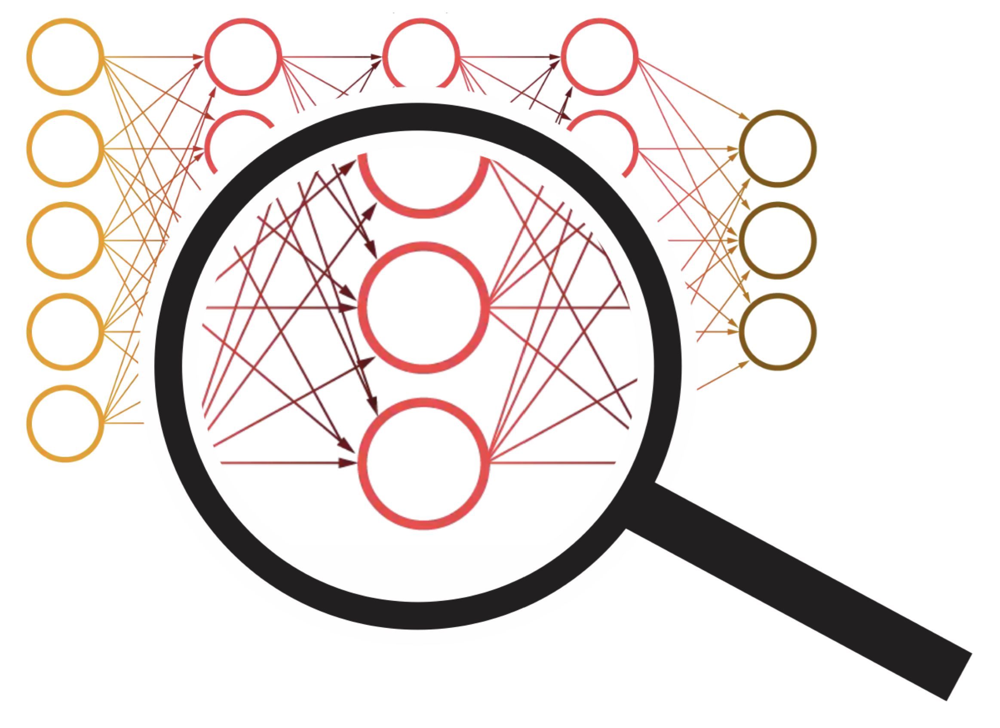
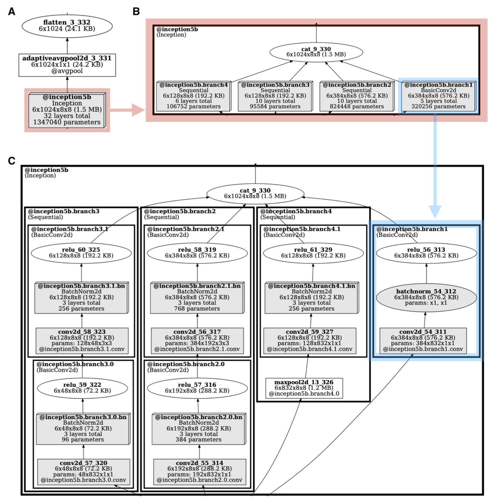
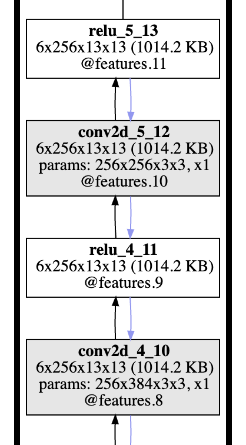

<p align="center">
  
</p>

<h1 align="center">TorchLens</h1>

<p align="center">
  Extract and visualize activations and computational graphs from any PyTorch model — in one line.
</p>

<p align="center">
  <a href="https://pypi.org/project/torchlens/">
    
  </a>
  <a href="https://pepy.tech/projects/torchlens">
    
  </a>
  <a href="https://pepy.tech/projects/torchlens">
    
  </a>
  <a href="https://github.com/johnmarktaylor91/torchlens/stargazers">
    
  </a>
</p>
<p align="center">
  <a href="https://pypi.org/project/torchlens/">
    
  </a>
  <a href="https://doi.org/10.1038/s41598-023-40807-0">
    
  </a>
</p>


<p align="center">
  <a href="https://www.nature.com/articles/s41598-023-40807-0">Paper</a> • 
  <a href="https://colab.research.google.com/drive/1ORJLGZPifvdsVPFqq1LYT3t5hV560SoW?usp=sharing">CoLab Tutorial</a> • 
  <a href="https://drive.google.com/drive/u/0/folders/1BsM6WPf3eB79-CRNgZejMxjg38rN6VCb">Model Gallery</a> • 
  <a href="https://static-content.springer.com/esm/art%3A10.1038%2Fs41598-023-40807-0/MediaObjects/41598_2023_40807_MOESM1_ESM.pdf">Metadata Overview</a>
</p>

---

## Overview

**TorchLens** is a Python library for doing exactly two things:

1. Extract **all intermediate activations** from any PyTorch model with **one line of code**.
2. Visualize the model's **computational graph** and get extensive metadata.

- #### No model modification required.
- #### Works for any PyTorch model. (Tested on over 700 different models)

---

## Example:
```python
import torchlens as tl

model_history = tl.log_forward_pass(pytorch_model, example_input, vis_opt='rolled')
```
This one line performs a forward pass, creates and displays the graph. 

It returns a ModelHistory object containing the intermediate layer activations and accompanying metadata.


---

## Installation
> Requires PyTorch version **1.8.0 or higher**

- #### Install Graphviz (required for visualization)
  `sudo apt install graphviz`

- #### Install TorchLens
  `pip install torchlens`


---
## Detailed examples

#### Simple Recurrent Model

```python
class SimpleRecurrent(nn.Module):
    def __init__(self):
        super().__init__()
        self.fc = nn.Linear(5, 5)

    def forward(self, x):
        for _ in range(4):
            x = self.fc(x)
            x = x + 1
            x = x * 2
        return x

simple_recurrent = SimpleRecurrent()
model_history = tl.log_forward_pass(simple_recurrent, x, layers_to_save='all', vis_opt='rolled')
```
<p align="center">

</p>


#### Complex Transformer Model

TorchLens also works with large models like [Swin V2](https://arxiv.org/abs/2103.14030), with 1932 operations.
<p align="center">
  
</p>

See more examples in the [Model Menagerie](https://drive.google.com/drive/u/0/folders/1BsM6WPf3eB79-CRNgZejMxjg38rN6VCb).

---

## Quickstart

```python
import torch
import torchvision
import torchlens as tl

alexnet = torchvision.models.alexnet()
x = torch.rand(1, 3, 224, 224)
model_history = tl.log_forward_pass(alexnet, x, layers_to_save='all', vis_opt='unrolled')
```
<p align="center">
  
</p>


### Accessing Layers

You can access any layer’s metadata and activations using several methods:

#### By name:
```python
print(model_history['conv2d_3_7'])
'''
Layer conv2d_3_7, operation 8/24:
	Output tensor: shape=(1, 384, 13, 13), dype=torch.float32, size=253.5 KB
		tensor([[ 0.0503, -0.1089, -0.1210, -0.1034, -0.1254],
        [ 0.0789, -0.0752, -0.0581, -0.0372, -0.0181],
        [ 0.0949, -0.0780, -0.0401, -0.0209, -0.0095],
        [ 0.0929, -0.0353, -0.0220, -0.0324, -0.0295],
        [ 0.1100, -0.0337, -0.0330, -0.0479, -0.0235]])...
	Params: Computed from params with shape (384,), (384, 192, 3, 3); 663936 params total (2.5 MB)
	Parent Layers: maxpool2d_2_6
	Child Layers: relu_3_8
	Function: conv2d (gradfunc=ConvolutionBackward0) 
	Computed inside module: features.6
	Time elapsed:  5.670E-04s
	Output of modules: features.6
	Output of bottom-level module: features.6
	Lookup keys: -17, 7, conv2d_3_7, conv2d_3_7:1, features.6, features.6:1
'''
```
#### By module
```python
print(model_history['features.6'])
```
#### By index
```python
print(model_history[7])
```
#### Activations
```python
print(model_history['conv2d_3_7'].tensor_contents)
'''
tensor([[[[-0.0867, -0.0787, -0.0817,  ..., -0.0820, -0.0655, -0.0195],
          [-0.1213, -0.1130, -0.1386,  ..., -0.1331, -0.1118, -0.0520],
          [-0.0959, -0.0973, -0.1078,  ..., -0.1103, -0.1091, -0.0760],
          ...,
          [-0.0906, -0.1146, -0.1308,  ..., -0.1076, -0.1129, -0.0689],
          [-0.1017, -0.1256, -0.1100,  ..., -0.1160, -0.1035, -0.0801],
          [-0.1006, -0.0941, -0.1204,  ..., -0.1146, -0.1065, -0.0631]]...
'''
```

To save only specific layers:

```python
model_history = tl.log_forward_pass(alexnet, x, vis_opt='unrolled', layers_to_save=['conv2d_3_7', 'features', -5, 'linear'])
print(model_history.layer_labels)
'''
['conv2d_3_7', 'maxpool2d_3_13', 'linear_1_17', 'dropout_2_19', 'linear_2_20', 'linear_3_22']
'''
```

---

## API Reference

- `log_forward_pass(model, input, ...)`: main function. Logs activations and metadata.
- `get_model_metadata(model, input)`: get only the metadata (no activations).
- `show_model_graph(model, input)`: render visual graph without saving tensors.
- `validate_model_activations(...)`: verify saved activations are accurate.

---

## Features

#### Visualize modules at different nesting levels:
Use the `vis_nesting_depth` argument in the `log_forward_pass` function.
<p align="center">
  
</p>

#### Visualize backward pass and gradients (experimental):

<p align="center">
  
</p>

#### Inspect the actual code used in each layer:

```python
print(model_history['conv2d_3'].func_call_stack[8])
'''
{'call_fname': '/usr/local/lib/python3.10/dist-packages/torchvision/models/alexnet.py',
 'call_linenum': 48,
 'function': 'forward',
 'code_context': ['            nn.Linear(256 * 6 * 6, 4096),\n',
  '            nn.ReLU(inplace=True),\n',
  '            nn.Dropout(p=dropout),\n',
  '            nn.Linear(4096, 4096),\n',
  '            nn.ReLU(inplace=True),\n',
  '            nn.Linear(4096, num_classes),\n',
  '        )\n',
  '\n',
  '    def forward(self, x: torch.Tensor) -> torch.Tensor:\n',
  '        x = self.features(x)\n',
  '        x = self.avgpool(x)\n',
  '        x = torch.flatten(x, 1)\n',
  '        x = self.classifier(x)\n',
  '        return x\n',
  '\n',
  '\n',
  'class AlexNet_Weights(WeightsEnum):\n',
  '    IMAGENET1K_V1 = Weights(\n',
  '        url="https://download.pytorch.org/models/alexnet-owt-7be5be79.pth",\n']}
'''
```


### Planned Features
1. Counterfactual activation editing (e.g. modifying activations or operations).
2. Submodule-only graph visualizations.


---

## Contact

For feedback, questions, or collaboration:

- Email: johnmarkedwardtaylor@gmail.com  
- Twitter: [@johnmark_taylor](https://twitter.com/johnmark_taylor)  
- GitHub: [Issues](https://github.com/johnmarktaylor91/torchlens/issues) • [Discussions](https://github.com/johnmarktaylor91/torchlens/discussions)

### The project is actively maintained. Contributions and bug reports are appreciated.

---


## Citation

If you use TorchLens, please cite:

```bibtex
@article{taylor2023extracting,
  title={Extracting and visualizing hidden activations and computational graphs of PyTorch models with TorchLens},
  author={Taylor, JohnMark and Kriegeskorte, Nikolaus},
  journal={Scientific Reports},
  volume={13},
  number={1},
  pages={14375},
  year={2023},
  publisher={Nature Publishing Group},
  doi={10.1038/s41598-023-40807-0}
}
```

### Acknowledgments

TorchLens development was supported by conversations with:

Nikolaus Kriegeskorte, George Alvarez, Alfredo Canziani, Tal Golan, and the Visual Inference Lab at Columbia University.  
Thanks to Kale Kundert for PyTorch Lightning compatibility contributions.  
All graphs made with Graphviz. Logo by Nikolaus Kriegeskorte.


### Related Projects

TorchLens focuses on activation extraction and graph visualization. For other tasks:

- [Cerbrec](https://cerbrec.com): Interactive visualization (uses TorchLens under the hood)
- [ThingsVision](https://github.com/ViCCo-Group/thingsvision): Model and data loading
- [Net2Brain](https://github.com/cvai-roig-lab/Net2Brain): Neural data comparison
- [surgeon-pytorch](https://github.com/archinetai/surgeon-pytorch): Activation slicing and loss training
- [deepdive](https://github.com/ColinConwell/DeepDive): Model benchmarking
- [torchvision feature_extraction](https://pytorch.org/vision/stable/feature_extraction.html): Static graph extraction
- [rsatoolbox3](https://github.com/rsagroup/rsatoolbox): RSA for brain/model activations
