# 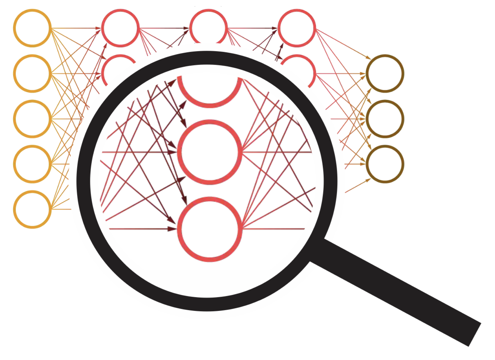 TorchLens

[](https://www.apache.org/licenses/LICENSE-2.0)

**See, save, and steer any PyTorch model.** TorchLens captures every activation
and gradient -- across the forward and backward pass -- auto-visualizes the full
computational graph, exposes rich per-op metadata, and lets you intervene on the
network as it runs. Any architecture, even dynamic and recurrent ones.

> **[Explore the Model Menagerie](https://model-menagerie.pages.dev)** -- a live, browsable atlas of
> **10,000+ unique neural-network architectures** captured with TorchLens, from McCulloch & Pitts (1943)
> to today's frontier models. *(Early preview.)*

Run on **10,000+ architectures** (image, video, audio, multimodal, language;
feedforward, recurrent, transformer, GNN), with **700+ rigorously validated** for
capture correctness — and it records **every last detail
of every part of your model**: **180+ metadata fields per operation**, and
**550+ fields in total** across every record type — operations, modules,
parameters, buffers, gradients, and the model itself.

```python
import torch, torchvision.models as models, torchlens as tl

model = models.alexnet(weights=None)
x = torch.randn(1, 3, 224, 224)

log = tl.trace(model, x)     # one call -- full graph + all activations
print(log.summary())          # module table, op count, FLOPs
print(log['relu_1_2'].out.shape)   # grab any activation by name ...
print(log['features.6'].out.shape) # ... or by module path
print(log[7].func_name)            # ... or by ordinal
log.draw()                    # PDF of the computational graph
```

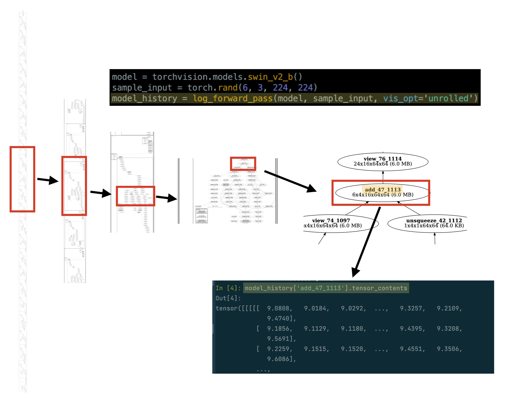

**Quick Links**

- [Paper](https://www.nature.com/articles/s41598-023-40807-0) |
  [10-minute tutorial notebook](notebooks/torchlens_in_10_minutes.ipynb) |
  [Facets tutorial](notebooks/facets_tutorial.ipynb) |
  [5-minute gallery](examples/5min/README.md) |
  [50-minute gallery](examples/50min/README.md)
- [Performance guide](docs/performance.md) |
  [AI-agent quick reference](docs/for-ai-agents.md) |
  [Limitations](docs/LIMITATIONS.md) |
  [Migration tables](docs/migration/)


## Installation

Install Graphviz first (required for graph visualizations), then TorchLens:

```bash
sudo apt install graphviz   # Debian/Ubuntu; see graphviz.org for other platforms
pip install torchlens
```

Compatible with PyTorch 1.8.0+.


## Quickstart

```python
import torch
import torchvision.models as models
import torchlens as tl

model = models.alexnet(weights=None)
x = torch.randn(1, 3, 224, 224)

log = tl.trace(model, x)
print(log.summary())
```

```
Model: AlexNet
+-----------------------------+---------------+--------+-------+
| Layer                       | Output Shape  | Params | Train |
+-----------------------------+---------------+--------+-------+
| input                       | [1,3,224,224] | 0      | -     |
| features (Sequential)       | [1,256,6,6]   | 2.5 M  | yes   |
| avgpool (AdaptiveAvgPool2d) | [1,256,6,6]   | 0      | -     |
| classifier (Sequential)     | [1,1000]      | 58.6 M | yes   |
| output                      | [1,1000]      | -      | -     |
+-----------------------------+---------------+--------+-------+
Params: 61,100,840 unique; trainable: 61,100,840
Ops: 22 total
Edges: 23 total
Forward FLOPs: 1.4 GFLOPs  MACs: 718.9 MFLOPs
```

Index any operation by name, module path, or ordinal:

```python
log['relu_1_2'].out.shape      # torch.Size([1, 64, 55, 55])
log['features.6'].out.shape    # same op via module path
log[7].func_name               # 'conv2d'
log['conv2d_3'].out.shape      # short name (ordinal suffix optional)
log[-1].layer_label            # 'output_1'
```

Visualize the graph as a PDF:

```python
log.draw()                        # unrolled by default
log.draw(vis_mode='rolled')       # rolled (compact for recurrent)
log.draw(vis_mode='unrolled')     # every pass as a distinct node
```

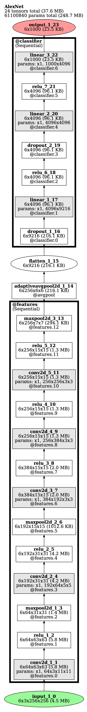


## What You Can Do

### 1. Flexible feature extraction

Save everything, or select exactly what you need:

```python
# Save only relu activations
log = tl.trace(model, x, save=tl.func('relu'))

# Save all ops inside the 'encoder' submodule
log = tl.trace(model, x, save=tl.in_module('encoder'))

# Save conv2d ops that are immediately followed by a relu, keeping a 4-op lookback window
conv_before_relu = tl.func('conv2d') & tl.followed_by(tl.func('relu'))
log = tl.trace(model, x, save=conv_before_relu,
               lookback=4, lookback_payload_policy='detached_raw')

# Stop capture early (can be faster than a plain forward pass)
log = tl.trace(model, x, save=tl.in_module('layer2'), halt=tl.in_module('layer2'))

# Lightweight sparse recording for tight loops -- materialize structure later
recording = tl.record(model, x, save=tl.func('relu'))
trace = recording.to_trace()

# One-line activation pull
act = tl.pluck(model, x, 'relu_1_2')   # returns tensor directly

# Batch extraction across a dataset
tl.extract_dataset(model, dataset, layers=['relu_1_2', 'conv2d_3_7'],
                   batch_size=32, output_dir='activations/')
```

**Performance note:** With `halt=` and `tl.record`, capture can run *faster
than the raw forward pass* -- measured at 0.84x raw on ResNet-18 and 0.83x on
GPT-2 (HookedTransformer) at 25% depth. Full exhaustive capture runs at
roughly 14x the raw forward and amortizes on large models. See
[docs/performance.md](docs/performance.md) for the full benchmark table.

Save and load traces portably:

```python
tl.save(log, 'my_trace')
loaded = tl.load('my_trace')
```

### 2. Forward AND backward pass

Capture per-op gradients with the same API:

```python
x = torch.randn(1, 3, 224, 224, requires_grad=True)
log = tl.trace(model, x, save_grads=True)
log.log_backward(log[log.output_layers[0]].out.sum())

grad = log['relu_1_2'].grad      # gradient tensor flowing through that op
print(grad.shape)                 # torch.Size([1, 64, 55, 55])
```

Narrow gradient saving to specific ops with the same selector predicates:

```python
log = tl.trace(model, x, save_grads=tl.func('relu'))
log.log_backward(log[log.output_layers[0]].out.sum())
```

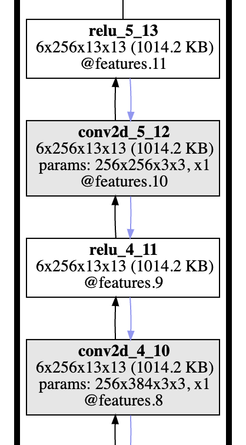

Backward capture is PyTorch-only. Non-torch backends expose derived leaf-level
gradients through a second AD pass. See [docs/backward.md](docs/backward.md).

### 3. Vast metadata per operation

Every operation records shape, dtype, device, timing, FLOPs, parameter info,
module containment, graph distances, conditional context, RNG state, and more.
The full print of any op includes all of this:

```python
print(log['conv2d_3_7'])
```

```
Layer conv2d_3_7, operation 7/22:
    Output tensor: shape=(1, 384, 13, 13), dtype=torch.float32, size=253.5 KB
        tensor([[-0.0198,  0.0946,  0.1109, ...
    Related Layers:
        - parent layers: maxpool2d_2_6
        - child layers: relu_3_8
    Params: Computed from params with shape (384, 192, 3, 3), (384,); 663936 params total (2.5 MB)
    Function: conv2d (grad_fn_handle: ConvolutionBackward0)
    Computed inside module: features.6:1
    Config: out_channels=384, in_channels=192, kernel_size=(3, 3), padding=(1, 1)
    Time elapsed: 1.4 ms
    Lookup keys: -17, 7, conv2d_3, conv2d_3:1, conv2d_3_7, conv2d_3_7:1, features.6, features.6:1
```

Every op also records the Python call stack that produced it, with file and
line number:

```python
loc = log['conv2d_3_7'].code_context[0]
print(loc.file, loc.line_number, loc.func_name)
```

Metadata is available as pandas DataFrames:

```python
df = log.to_pandas()            # one row per op
params_df = log.params.to_pandas()
modules_df = log.modules.to_pandas()
```

### 4. Automatic visualization

```python
log.draw()                           # default: unrolled with sibling ordering
log.draw(vis_mode='rolled')          # compact rolled layout
log.draw(vis_mode='unrolled')        # every pass as a distinct node
```

Control nesting depth to zoom in on submodules:

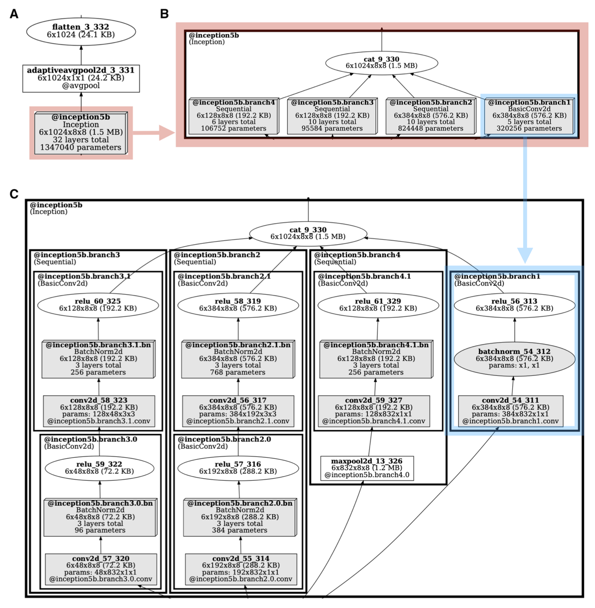

For recurrent models, the rolled view collapses repeated structure cleanly:

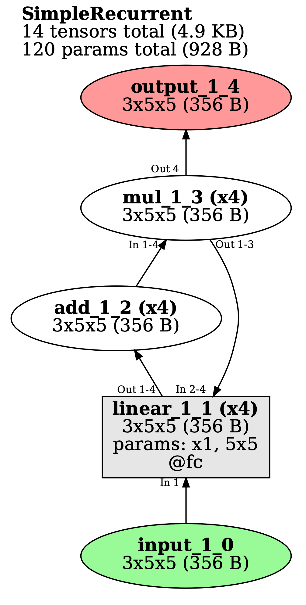

```python
class SimpleRecurrent(torch.nn.Module):
    def __init__(self):
        super().__init__()
        self.fc = torch.nn.Linear(in_features=5, out_features=5)
    def forward(self, x):
        for r in range(4):
            x = self.fc(x)
            x = x + 1
            x = x * 2
        return x

model = SimpleRecurrent()
x = torch.randn(6, 5)
log = tl.trace(model, x)
print(log['linear_1:2'].out)     # second pass of the linear layer
log.draw(vis_mode='rolled')
```

### 5. Interventions

Ablate, steer, scale, or replace activations during the forward pass:

```python
# Zero-ablate all relu activations inline during capture
ablated = tl.trace(model, x, save=tl.func('relu'),
                   intervene=tl.when(tl.func('relu'), tl.zero_ablate()))
print(ablated['relu_1_2'].out.abs().max())  # tensor(0.)

# Scale relus to 50%
scaled = tl.trace(model, x, save=tl.func('relu'),
                  intervene=tl.when(tl.func('relu'), tl.scale(0.5)))
```

Available helpers: `tl.zero_ablate`, `tl.mean_ablate`, `tl.resample_ablate`,
`tl.steer`, `tl.scale`, `tl.clamp`, `tl.noise`, `tl.project_onto`,
`tl.project_off`, `tl.swap_with`, `tl.splice_module`.

For post-hoc DAG replay and isolated experiments, capture with
`intervention_ready=True` and use `log.fork()` + `log.replay()` /
`log.rerun(model, x)`. Live hooks during rerun require capture-time selectors
(e.g. `tl.func(...)`, `tl.module(...)`); finalized labels resolve via
`log.find_sites(...)`. See [docs/intervention_api.md](docs/intervention_api.md)
for the full reference.

Compare multiple runs side by side with `tl.bundle`:

```python
bundle = tl.bundle({'clean': clean_log, 'patched': patched_log}, baseline='clean')
bundle.compare_at(tl.func('relu'))
```

**Facets** provide named sub-views for attention heads, LSTM outputs, and
fused projections (for models with those structures):

```python
# ViT / transformer model with attention blocks
log = tl.trace(vit_model, x)
q = log.modules['blocks.0.attn'].facets['q']    # query vectors for head 0
h_n = log.modules['lstm'].facets['h_n']         # LSTM final hidden state
```

See [docs/facets.md](docs/facets.md) for the full facets reference, including
activation patching helpers, SDPA reconstruction, and TransformerLens aliases.

See [docs/intervention_api.md](docs/intervention_api.md) for the full selector
and helper reference.

### 6. Works on anything, including dynamic and recurrent models

TorchLens uses eager-mode Python-level function wrapping rather than graph
tracing. This means it captures whatever actually runs, including:

- Dynamic control flow (if/else branching, loops, early exits)
- Recurrent architectures (RNNs, LSTMs, state-space models)
- Transformer variants including fused attention
- Graph neural networks
- Mixed architectures

This is the key differentiator from static-graph extractors like
`torchvision.feature_extraction`, which require static computational graphs
and cannot handle dynamic architectures.

**Multi-backend.** The same `tl.trace` API works across frameworks via
`backend=`:

| Capability | PyTorch | JAX (preview) | tinygrad (preview) | MLX (preview) | Paddle (preview) | TensorFlow (preview) |
|---|:---:|:---:|:---:|:---:|:---:|:---:|
| Forward capture + graph/metadata | yes | yes | yes | yes | yes | yes |
| Module hierarchy | `torch_module` | Equinox/Flax NNX `pytree_module`; raw `function_root` | `object_module`; raw `function_root` | `object_module`; raw `function_root` | `object_module`; raw `function_root` | Keras/`tf.Module` `object_module`; raw `function_root` |
| Control-flow unroll | eager Python | `lax.scan`/`cond`/`while_loop` | lazy UOp graph | limited | dygraph/eager Python only | eager Python control flow |
| Static-label `save=` | yes | yes | yes | yes | yes | yes |
| Portable array `.tlspec` payloads | full | forward/derived arrays | forward/derived arrays | forward/derived arrays | forward/derived arrays | forward arrays |
| Gradients | full backward graph | leaf-level + zero-tap T1 intermediate derived | leaf-level + T1 intermediate derived | leaf-level + custom-VJP-tap T1 intermediate derived | leaf-level + T1 intermediate derived | deferred |
| Interventions / halt / fastlog | yes | -- | -- | -- | -- | -- |

```python
log = tl.trace(torch_model, x)                      # PyTorch (default)
log = tl.trace(jax_fn,      inputs, backend='jax')  # JAX preview
log = tl.trace(tg_fn,       inputs, backend='tinygrad')
log = tl.trace(paddle_model, x,     backend='paddle')
log = tl.trace(tf_model,    x,      backend='tf')
```

PyTorch remains the full-feature backend. Preview backends are pinned and
documented in [`docs/`](docs/).


## Gallery

TorchLens visualizes any architecture -- no matter how exotic. Explore the
**[Model Menagerie](https://model-menagerie.pages.dev)**: a browsable atlas of **10,000+ unique
neural-network architectures** -- from McCulloch & Pitts (1943) to today's frontier models -- each with
structured metadata and a faithful TorchLens-rendered diagram.

> **Early preview.** The gallery is live and growing; full-text search, a downloadable dataset, and
> richer per-model pages are on the way.

A sample across families is shown below.

**Classic CNN + Vision Transformer**

| GoogLeNet (inception + buffer edges) | Stable Diffusion (U-Net denoiser) | CLIP (vision + language towers) |
|:---:|:---:|:---:|
| 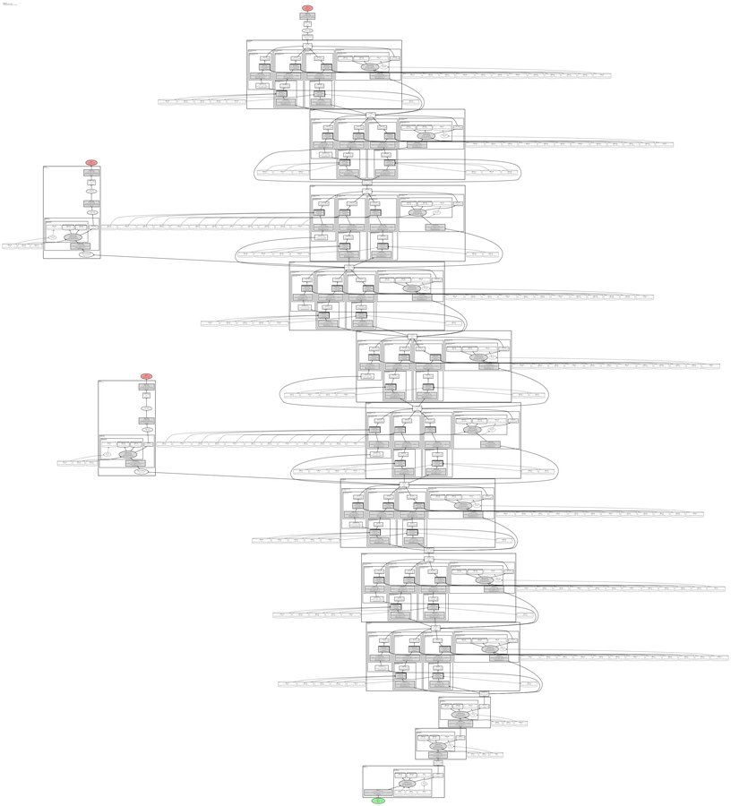 | 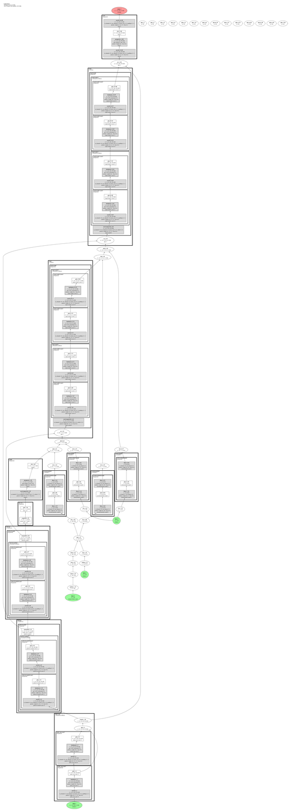 | 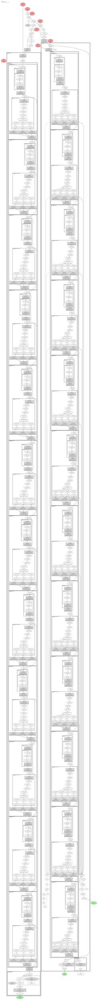 |

**State-Space + Recurrence**

| Mamba (selective SSM) | Recurrent Gemma (linear recurrence) | Whisper (audio encoder-decoder) |
|:---:|:---:|:---:|
| 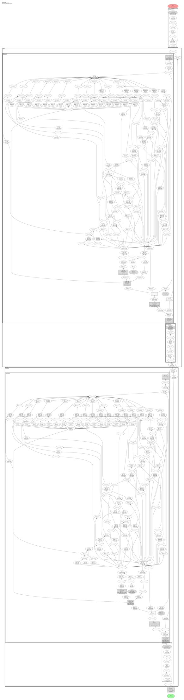 | 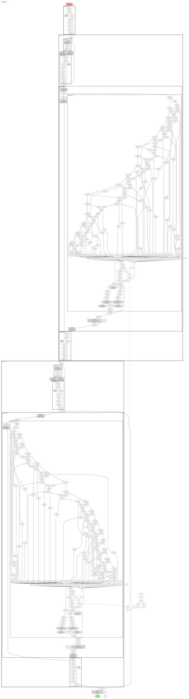 | 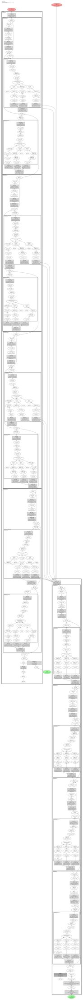 |

**Mixture-of-Experts + Generative**

| Mixtral (sparse MoE) | Hierarchical VAE | Perceiver |
|:---:|:---:|:---:|
| 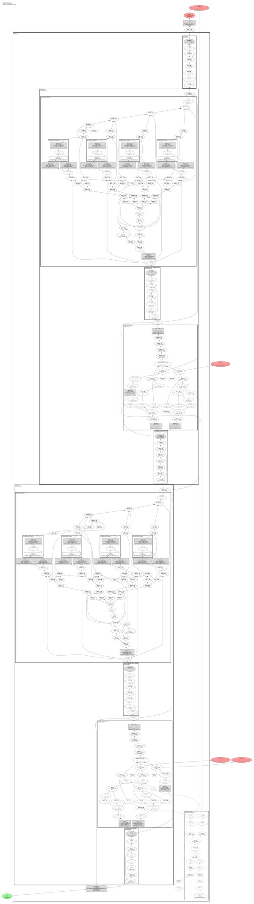 | 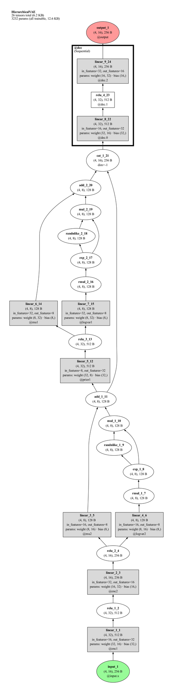 | 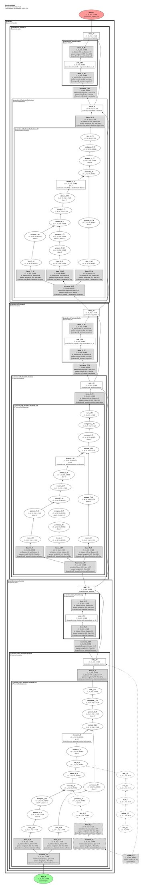 |

**Graph Networks + Exotic**

| DimeNet (molecular GNN) | CORnet-S (visual cortex, unrolled) | LLaMA (decoder-only LLM) |
|:---:|:---:|:---:|
| 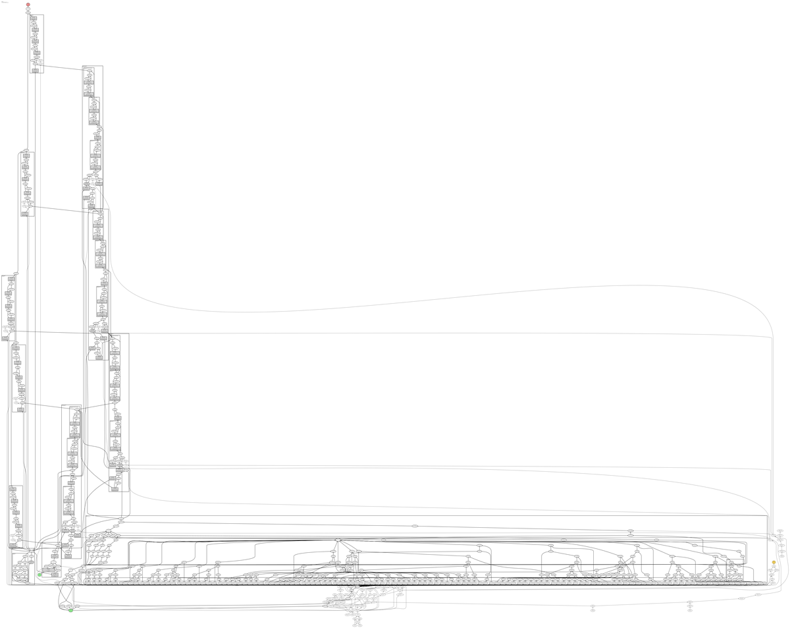 | 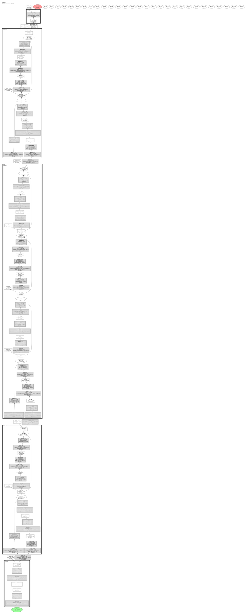 | 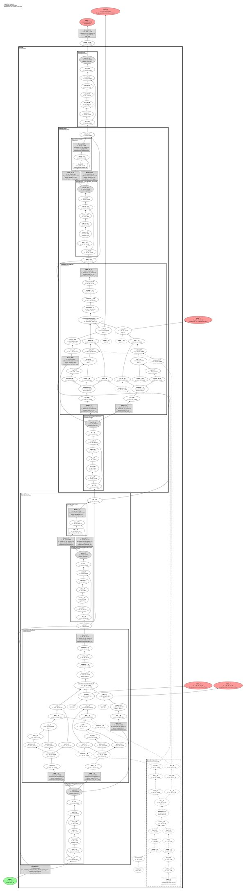 |

**Reinforcement Learning + Quantum ML + Scale**

| Decision Transformer (offline RL) | Quantum ML circuit | 3,000-node graph (SFDP layout) |
|:---:|:---:|:---:|
| 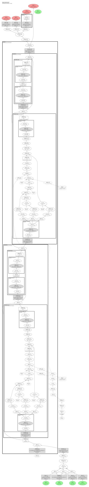 | 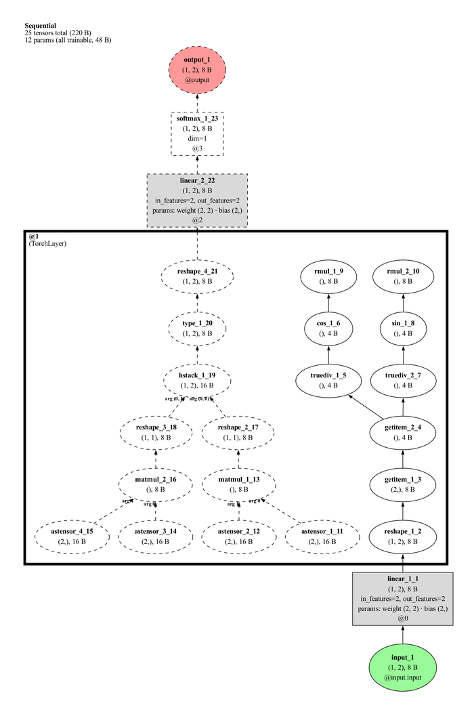 | 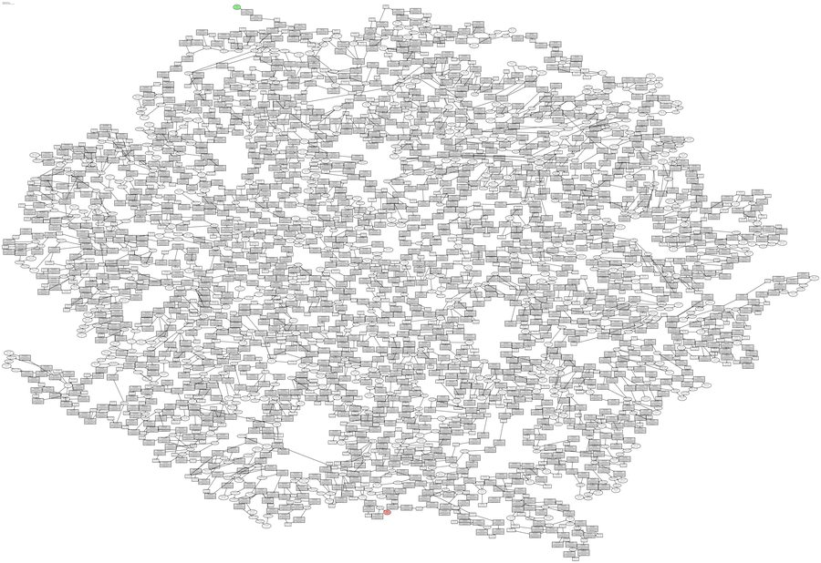 |


## Compatibility

Before filing a bug for a model-specific failure, run the runtime compatibility
report:

```python
compat = tl.compat.report(model, x)
print(compat.to_markdown())
```

`tl.compat.report` inspects the model wrapper, modules, parameter sharing,
input tensors, CUDA visibility, and common framework markers, then reports
each row as `pass`, `known_broken`, `scope`, or `not_tested`.

TorchLens is **not** compatible with `torch.compile`'d models, TorchScript,
or `torch.export` -- the forward pass does not run as ordinary Python, so the
wrappers cannot intercept ops. It also has specific behaviors around FSDP,
sparse tensors, meta tensors, quantization, and `torch.func.vmap`.

See [LIMITATIONS.md](LIMITATIONS.md) for the full matrix: what fails, what
works, and the recommended workaround for each context.


## Tutorials and Docs

| Resource | Description |
|---|---|
| [torchlens_in_10_minutes.ipynb](notebooks/torchlens_in_10_minutes.ipynb) | Core workflow: trace, index, visualize |
| [facets_tutorial.ipynb](notebooks/facets_tutorial.ipynb) | Attention heads, LSTM facets, patching |
| [backward_tutorial.ipynb](notebooks/backward_tutorial.ipynb) | Gradient capture and backward visualization |
| [training_tutorial.ipynb](notebooks/training_tutorial.ipynb) | Training with captured activations |
| [huggingface_tutorial.ipynb](notebooks/huggingface_tutorial.ipynb) | HuggingFace transformer models |
| [fastlog_tutorial.ipynb](notebooks/fastlog_tutorial.ipynb) | High-throughput sparse recording |
| [docs/intervention_api.md](docs/intervention_api.md) | Full selector and helper reference |
| [docs/backward.md](docs/backward.md) | Backward capture details and limitations |
| [docs/facets.md](docs/facets.md) | Facets, patching, and SDPA reconstruction |
| [docs/performance.md](docs/performance.md) | Speed knobs and benchmark numbers |


## Security

Portable bundles contain a pickle file in `metadata.pkl`. Only load bundles
from trusted sources. Loading an untrusted bundle with `tl.load()` can execute
arbitrary code.


## Other Packages You Should Check Out

TorchLens focuses on activation extraction, graph visualization, and intervention
and intentionally omits model loading, stimulus management, and analysis pipelines.
These packages cover that ground well:

- [Cerbrec](https://cerbrec.com): interactive visualization and debugging for deep neural networks (uses TorchLens under the hood for PyTorch graph extraction)
- [ThingsVision](https://github.com/ViCCo-Group/thingsvision): model loading, stimulus management, and representational analysis for vision models
- [Net2Brain](https://github.com/cvai-roig-lab/Net2Brain): end-to-end pipeline for comparing DNN representations to neural data
- [surgeon-pytorch](https://github.com/archinetai/surgeon-pytorch): lightweight activation extraction with training-loss hooks
- [deepdive](https://github.com/ColinConwell/DeepDive): model loading and benchmarking across many model families
- [torchvision feature_extraction](https://pytorch.org/vision/stable/feature_extraction.html): fast activation extraction for models with static computational graphs
- [rsatoolbox](https://github.com/rsagroup/rsatoolbox): representational similarity analysis for DNN activations and brain data


## Acknowledgments

The development of TorchLens benefitted greatly from discussions with Nikolaus
Kriegeskorte, George Alvarez, Alfredo Canziani, Tal Golan, and the Visual
Inference Lab at Columbia University. Thank you to Kale Kundert for helpful
discussion and code contributions enabling PyTorch Lightning compatibility.
Network visualizations are generated with Graphviz. Logo created by Nikolaus
Kriegeskorte.


## Citing TorchLens

To cite TorchLens, please cite
[this paper](https://www.nature.com/articles/s41598-023-40807-0):

Taylor, J., Kriegeskorte, N. Extracting and visualizing hidden activations and
computational graphs of PyTorch models with TorchLens. *Sci Rep* 13, 14375
(2023). https://doi.org/10.1038/s41598-023-40807-0

If you find TorchLens useful, a star on this repo is appreciated.


## Contact

TorchLens is in active development. Questions, bug reports, and suggestions are
welcome via [email](mailto:johnmarkedwardtaylor@gmail.com),
[Twitter](https://twitter.com/johnmark_taylor), the
[issues page](https://github.com/johnmarktaylor91/torchlens/issues), or the
[discussion board](https://github.com/johnmarktaylor91/torchlens/discussions).
