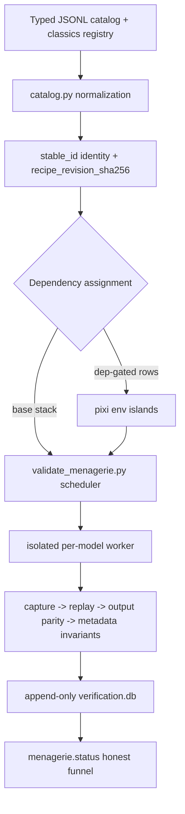

# Menagerie Validation

The TorchLens menagerie is a browsable, queryable atlas of 11,600+ neural-network
architecture families. Each verified row is not just instantiated or rendered: it is
captured by TorchLens and algorithmically checked with forward replay plus the
TorchLens metadata-invariant tripwire.

The public status should be read as approximate and moving. The campaign is roughly
89% verified and climbing, with about 5,400 distinct architectures after collapsing
shape-blind graph hashes. For exact local counts, rebuild or inspect the catalog and
ledger:

```bash
python -m menagerie.catalog build
python -m menagerie.status
python -m menagerie.status --completeness
```

`menagerie.status` is the source of truth for the current checkout because it joins the
current catalog recipe revisions against the append-only verification ledger and the
current TorchLens version.

## What "Validated" Means

A menagerie row is validated only when the current recipe for that stable model
identity passes the current TorchLens version's verification predicate:

1. Build the model from the catalog recipe with random initialization.
2. Build the declared example input.
3. Capture the forward pass with TorchLens.
4. Replay the captured activations through TorchLens forward validation.
5. Compare replayed outputs against the model's normal forward outputs.
6. Run TorchLens metadata validation on the captured trace.
7. Record a graph-shape hash and operation count for the passed trace.

In code, the validator calls TorchLens forward validation with
`validate_metadata=True`. A pass therefore means both output replay and metadata
invariants survived the same capture. A failure is not waved through as "the model ran";
it is recorded as a failure because either model construction/input construction did not
produce a runnable PyTorch case, output replay disagreed, metadata validation tripped, a
timeout fired, a memory cap was exceeded, or the required environment was unavailable.

This is stronger than plain hooks or smoke tests. A hook-only test can prove that a
forward call executed and that some tensors were observed. It does not prove that the
captured graph can reproduce the model's output, that parent/child metadata is coherent,
that saved payloads line up with TorchLens operation names and identities, or that the
trace is suitable for downstream querying, graph rendering, and replay-oriented
debugging. Menagerie validation tests those properties directly.

## Pipeline



### Catalog Identity

The catalog is built from typed JSONL plus the hand-built classics registry. Normalized
rows live in rebuildable derived artifacts such as `catalog_canonical.tsv` and
`catalog.db`; source rows stay in JSONL or `menagerie/classics/`.

Each row has two identity layers:

- `stable_id` is an opaque durable identity for the natural key `(name, zoo, variant)`.
  It is intentionally not the display index.
- `recipe_revision_sha256` fingerprints the current construction recipe. For normal
  catalog rows this is the constructor recipe; for classics it is the module path and
  build function.

This lets the validator distinguish "same displayed architecture, same recipe" from
"same stable model identity, but its recipe changed and must be revalidated."

### Recipes And Inputs

Catalog recipes instantiate models in random-init form. The input builder constructs the
declared example input for that row. Some architectures cannot honestly be reduced to a
concrete local random-init PyTorch example because they require gated weights, web-only
configuration, non-PyTorch execution, unavailable custom data objects, or an unresolved
input recipe. Those rows are not hidden; they are deferred or skipped with a reason.

### Append-Only Ledger

`menagerie/data/verification.db` stores verification runs in an append-only SQLite
ledger. Updates and deletes are blocked by triggers. The latest forward run per
`stable_id` is exposed through `current_verification`, but the history remains available
for audit.

The verified count is deliberately strict. A row contributes to the headline only when
the latest relevant ledger row has:

- current `stable_id`;
- current `recipe_revision_sha256`;
- current `torchlens_version`;
- `forward_pass = 1`;
- `metadata_ok = 1`;
- non-null `n_ops`;
- non-null `graph_shape_hash`.

Old successes do not count after a recipe revision changes or after the verified
predicate is evaluated for a new TorchLens version. Re-runs are therefore incremental
but honest: unchanged current rows can be skipped, while new rows, changed recipes, and
new TorchLens versions need fresh terminal rows.

### Environment Islands

Most rows run in the base TorchLens environment. Dependency-gated rows are assigned to
locked pixi "islands" by `menagerie.envs`. Each island has a deterministic pixi manifest
and lock, a managed cache directory, smoke stable IDs, a disk estimate, and an explicit
status policy for unavailable or failed environments.

This keeps incompatible dependency stacks isolated. If an island cannot be built or is
not available on the machine, affected rows are recorded as `env_unavailable` or
`install_failed` rather than silently disappearing from the denominator.

### Memory-Aware Scheduler

`menagerie.validate_menagerie` validates rows in isolated child processes. The parent
uses threads only to dispatch and await those workers; manifest and ledger appends are
performed by the main thread as results complete.

The scheduler records each worker's peak resident set size (`peak_rss_mb`) and uses the
latest ledger measurement as the future estimate for that stable ID. Unknown rows use a
conservative default; known heavy segmentation-style rows use a larger default. Admission
is gated by:

- `--jobs`, the hard concurrency cap;
- `--gpu-jobs`, the CUDA/auto-device in-flight cap;
- `--memory-budget-gb`, the estimated total in-flight RSS budget, defaulting to 70% of
  currently available RAM when no per-worker cap is set;
- `--memory-floor-gb`, the actual free-memory floor before starting another worker;
- `--worker-memory-cap-gb`, an optional hard RSS cap inside each worker.

If a single row is estimated above the scheduler budget, it may be admitted alone and
logged as oversized. If a worker exceeds `--worker-memory-cap-gb`, the worker emits a
`failed:memory_cap` result with the observed peak RSS and exits with a known code. That
turns "too large for this machine" into an honest terminal result instead of a parent
process OOM.

## Status Taxonomy

The reporting funnel is intentionally explicit:

- `validated`: capture, forward replay, output parity, metadata validation, op count,
  and graph-shape hash succeeded.
- `failed`: the row was attempted and TorchLens/model validation failed. Subreasons in
  the manifest include exceptions, replay failures, trace-summary failures, and memory
  cap breaches.
- `timeout`: the isolated worker exceeded `--timeout-sec`.
- `too_large` / memory: the row exceeded the worker RSS cap, recorded in the manifest as
  `failed:memory_cap` and in the ledger as a failed run with `peak_rss_mb`.
- `env_unavailable` / `install_failed`: a dependency island or dependency install could
  not be made available.
- `skipped`: the row is intentionally not run in the current pass, such as dry runs,
  unsupported input recipes, dependency-unavailable rows in manifest output, or other
  deferred/dependency reasons.
- `deferred`: catalog metadata says the row is not currently expected to validate and
  records the reason.

Nothing is removed from the accounting because it is inconvenient. The residual is part
of the status output.

## Running Validation

For a normal incremental validation pass in an already prepared environment:

```bash
python -m menagerie.validate_menagerie \
  --out-dir /tmp/torchlens_menagerie_validation \
  --memory-budget-gb 48 \
  --worker-memory-cap-gb 16 \
  --timeout-sec 240
```

For a small local smoke:

```bash
python -m menagerie.validate_menagerie \
  --zoo classics-pytorch \
  --subset 3 \
  --no-install-deps \
  --out-dir /tmp/val_smoke
```

For retrying only rows that are present in the validation manifest but did not validate:

```bash
python -m menagerie.validate_menagerie \
  --out-dir /tmp/torchlens_menagerie_validation \
  --revalidate-failed
```

For regenerating summary artifacts from an existing manifest:

```bash
python -m menagerie.validate_menagerie \
  --out-dir /tmp/torchlens_menagerie_validation \
  --report-only
```

The validator writes:

- `validation_manifest.tsv`, an append-only resumable per-run manifest;
- `validation_summary.json`, machine-readable totals;
- `VALIDATION_REPORT.md`, human-readable totals and failures;
- ledger rows in `menagerie/data/verification.db`.

The manifest makes local re-runs convenient: by default, rows already present in the
manifest are skipped; `--revalidate-failed` retries only non-validated manifest rows.
The ledger is the longer-lived audit source and is what `menagerie.status` uses for the
current-recipe/current-version verified predicate.

For dependency-island runs, use the pixi environment manager rather than installing
incompatible packages into one interpreter. Lock/build the relevant islands, then run
validation inside the island selected for each dependency cluster. If an island is not
available, record that status; do not mark the architecture as validated.

## Reimplement-As-Classic Backstop

Some important architectures have no buildable public package path, have abandoned
dependencies, require unavailable weight downloads, or expose only paper/config
descriptions. The backstop is to add a faithful random-init reimplementation under
`menagerie/classics/` and validate that implementation through the same pipeline.

This is not a provenance shortcut. Classics are identified as classics in the catalog,
their recipe revision hashes point at the reimplementation module and build function,
and they still must pass capture, replay, output parity, and metadata validation. The
claim is therefore "TorchLens validates a faithful random-init implementation of this
architecture family," not "the original third-party package was executed."

## Maintainer Checklist

1. Add or update source rows in typed JSONL, or add a scoped classic when the package
   path is not buildable.
2. Rebuild the catalog with `python -m menagerie.catalog build`.
3. Run an incremental validation pass with explicit memory and timeout settings.
4. Inspect `VALIDATION_REPORT.md`, `validation_summary.json`, and
   `python -m menagerie.status`.
5. For a release or public headline, use the `menagerie.status` verified count and
   distinct-architecture report, not a raw manifest row count.
