# Smart-collapse visual reference

The images on this page are generated by
[`scripts/render_collapse_reference.py`](../../scripts/render_collapse_reference.py).
Run `PYTHONPATH=$PWD python scripts/render_collapse_reference.py` after rendering changes; it
updates this gallery and stages the same files in `/tmp/collapse_renders/` for review.

## The mode ladder

The same ResNet-18 execution is shown at each string mode. `none` preserves the full graph,
`auto` chooses the first schedule point in the readable band, and `max` applies the strongest
legal condensation.

*`collapse="none"`: every operation is visible, including the repeated residual stages that make
an overview hard to scan.*

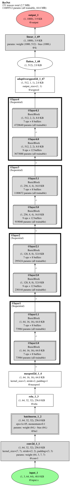

*`collapse="auto"`: representative module boxes preserve the stem-to-stage-to-head story while
their labels account for hidden work.*

*`collapse="max"`: the same trace is condensed as far as the renderer can do honestly; it is not
a different execution.*

## The float-`t` schedule

A float `t` in `[0.0, 1.0]` selects the deterministic monotone collapse schedule. `0.0` equals
`"none"`, `1.0` equals `"max"`, and increasing `t` never expands a previously hidden address.

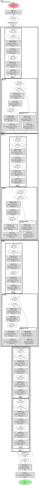

*`t=0.0`: the full graph endpoint.*

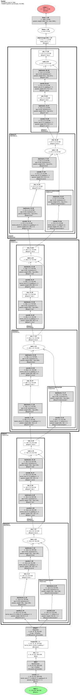

*`t=0.25`: the first intermediate schedule point.*

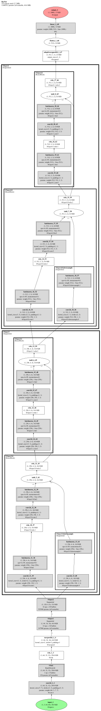

*`t=0.5`: a further-condensed view of exactly the same execution.*

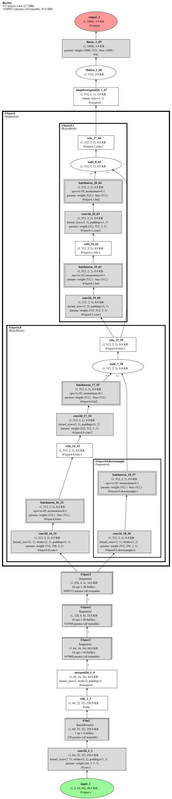

*`t=0.75`: hidden module addresses remain a superset of those at lower `t`.*

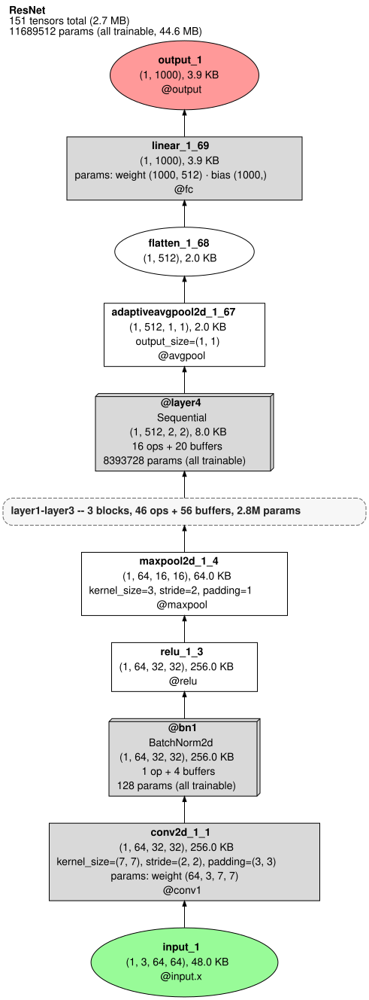

*`t=1.0`: the maximum-collapse endpoint.*

## `fold_repeats`

Run folding is independent of module collapse. These two views use the same eight-block residual
stack with `collapse="none"`; the right-hand view folds only the repeated sibling run.

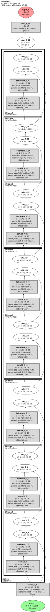

*`fold_repeats=False`: all eight distinct residual-block instances are shown.*

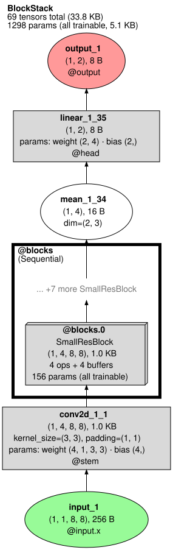

*`fold_repeats=True`: one representative remains and the ellipsis accounts for the other
same-class siblings; the stem and head remain at full detail.*

## Segment boxes

`collapse="max"` can replace a legal consecutive sibling interval with a dashed segment box.
Legal means the members ran back to back in execution order and each feeds the next directly:
a box never groups same-kind siblings that alternate with other siblings, and never hides a
parent-owned op between its members, so the collapsed graph shows no edge or cycle the traced
network lacks.

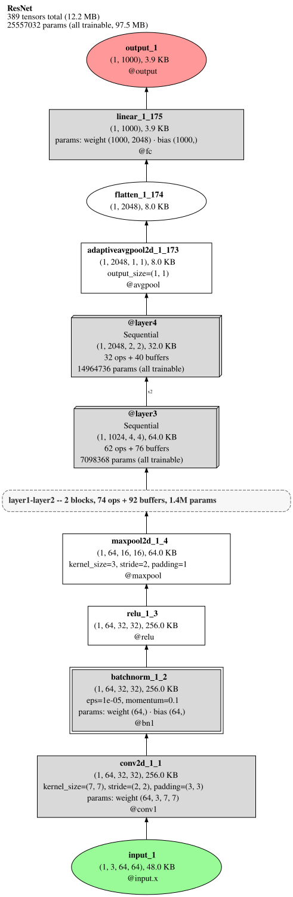

*The dashed segment boxes in this ResNet-50 maximum-collapse view name an address range and totals.
They assert adjacency only: a segment is not a real module and never pretends mixed content has one
module class.*

## What `(xN)` and `+N more` promise

These labels look similar but make different, deliberately strict promises about hidden content.

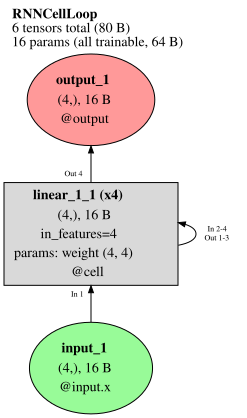

*`(xN)` is a true recurrence multiplier: the **same parameters** were applied `N` times. This
rolled RNN-cell loop has weight reuse, not `N` independent blocks.*

*`+N more Class` means `N` additional **distinct same-class instances**, each with its own
parameters. The representative box describes one instance; the ellipsis makes the omitted sibling
count explicit. Collapsed-box remainders and segment totals likewise count everything they hide,
including buffer leaves. This is the honesty contract: labels never claim a repeated call, module,
or total that the hidden content does not support.*

## The compute ceiling

Smart-collapse admission is now gated on the RENDERED UNIVERSE, not raw op count
(collapse memo D5): the gate variable is `U` — the full plan's rendered node count after
`module=` focus, `vis_call_depth`, and rolled reductions — tiered by a measured
`(U, W)` work estimator (`0.0095 * U**1.43 * W**1.02` ms, W = widest rendered sibling
group). `COLLAPSE_OPTIMIZER_MAX_OPS` (2000) survives as the defensive constant: the
quality planner is admitted when `U <= 2000` AND the predicted cost fits the budget.

- Over-budget requests **degrade to a deterministic compact fallback plan**
  (significance-greedy boxes plus standard fold discovery), disclosed with the coded
  `collapse_budget_fallback` warning and `OptimizerResult.planner="linear_fallback"` —
  never an uncollapsed wall.
- Only PATHOLOGICAL inputs (raw ops above 20x the constant) still decline outright:
  `draw` warns (`collapse_pathological_skip`) and renders uncollapsed,
  `Trace.collapse_plan()` refuses typed (`collapse_plan_unavailable`, reason
  `collapse_ops_ceiling`), and `Trace.collapse_schedule()` degrades to its single
  full-graph step.
- A generous wall-clock watchdog (off in CI and under `TORCHLENS_DETERMINISTIC`;
  `TORCHLENS_COLLAPSE_WATCHDOG=0` disables) may abandon the quality planner mid-run to
  the same fallback; every firing is disclosed as an estimator bug
  (`collapse_watchdog_fallback`, with U, W, predicted, and actual).

Context reductions are therefore real remedies for the first time: focusing with
`module=`, bounding `vis_call_depth`, or rendering rolled genuinely re-admits the
quality planner. The gate is a compute guard, not a correctness limit — the trace
itself is complete.

## `collapse_plan()` diagnostics

`Trace.collapse_plan(mode=...)` exposes the renderer-faithful plan for one requested mode.
`Trace.collapse_schedule()` exposes its ordered float steps, targets, visible counts, and collapsed
module addresses. Use these diagnostics to inspect a rendering decision rather than inferring it
from pixels.

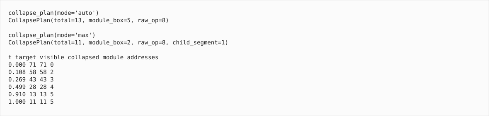

*This image is generated from the same ResNet-18 trace as the ladder. It shows real `auto` and
`max` plans followed by every schedule step; visible counts are monotone as `t` increases.*

## The compute ceiling

Smart-collapse admission is now gated on the RENDERED UNIVERSE, not raw op count
(collapse memo D5): the gate variable is `U` — the full plan's rendered node count after
`module=` focus, `vis_call_depth`, and rolled reductions — tiered by a measured
`(U, W)` work estimator (`0.0095 * U**1.43 * W**1.02` ms, W = widest rendered sibling
group). `COLLAPSE_OPTIMIZER_MAX_OPS` (2000) survives as the defensive constant: the
quality planner is admitted when `U <= 2000` AND the predicted cost fits the budget.

- Over-budget requests **degrade to a deterministic compact fallback plan**
  (significance-greedy boxes plus standard fold discovery), disclosed with the coded
  `collapse_budget_fallback` warning and `OptimizerResult.planner="linear_fallback"` —
  never an uncollapsed wall.
- Only PATHOLOGICAL inputs (raw ops above 20x the constant) still decline outright:
  `draw` warns (`collapse_pathological_skip`) and renders uncollapsed,
  `Trace.collapse_plan()` refuses typed (`collapse_plan_unavailable`, reason
  `collapse_ops_ceiling`), and `Trace.collapse_schedule()` degrades to its single
  full-graph step.
- A generous wall-clock watchdog (off in CI and under `TORCHLENS_DETERMINISTIC`;
  `TORCHLENS_COLLAPSE_WATCHDOG=0` disables) may abandon the quality planner mid-run to
  the same fallback; every firing is disclosed as an estimator bug
  (`collapse_watchdog_fallback`, with U, W, predicted, and actual).

Context reductions are therefore real remedies for the first time: focusing with
`module=`, bounding `vis_call_depth`, or rendering rolled genuinely re-admits the
quality planner. The gate is a compute guard, not a correctness limit — the trace
itself is complete.

The decline is disclosed, never silent. To get a collapsed view of a very large trace, reduce
the rendered graph first with `module=` focus, `vis_call_depth`, or rolled mode; `fold_repeats`
and `show_containers` styling are unaffected.
